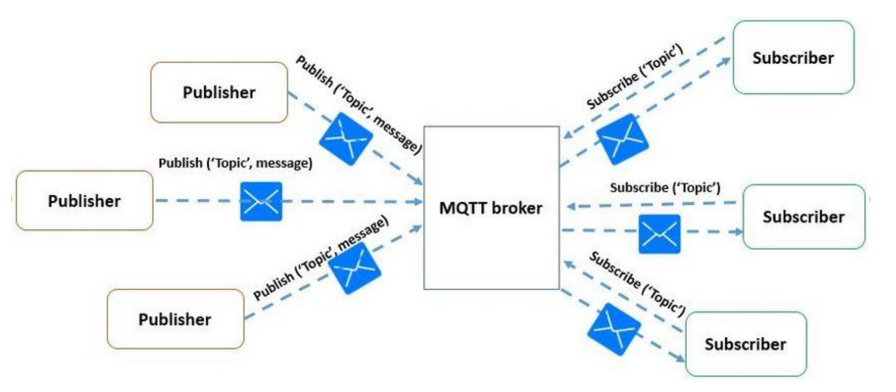

## CURS 2

## 1. MQTT (Message Queuing Telemetry Transport)
- **Latență**: Scăzută, protocolul este optimizat pentru rețele cu latență ridicată.
- **Limitări**: Proiectat pentru dispozitive cu resurse limitate, este vulnerabil fără criptare, deoarece nu include securitate în mod nativ.
- **Lățime de bandă**: Redusă, MQTT are overhead mic, fiind optimizat pentru comunicații cu consum redus de bandă.
- **Frecvență de operare**: Poate funcționa pe TCP/IP, utilizat în mod obișnuit pentru aplicații de monitorizare și telemetrie.
- **Rată de transfer**: Depinde de conexiunea rețelei și poate susține QoS la trei niveluri (0 - cel mult o dată, 1 - cel puțin o dată, 2 - exact o dată) pentru a asigura fiabilitatea mesajelor.

## 2. HTTP (Hypertext Transfer Protocol)
- **Latență**: Ridicată, deoarece folosește un model request-response, iar fiecare cerere inițiază o conexiune nouă (excepție HTTP/2).
- **Limitări**: Consum mare de resurse, potrivit pentru aplicații care au o sursă constantă de energie, dar nu pentru dispozitive IoT pe baterie.
- **Lățime de bandă**: Mare, protocolul are un overhead semnificativ datorită structurii textuale și a anteturilor detaliate.
- **Rată de transfer**: Limitată la performanța TCP, HTTP nu oferă mecanisme QoS și poate deveni ineficient în rețele congestionate.

## 3. CoAP (Constrained Application Protocol)
- **Latență**: Foarte scăzută, CoAP utilizează UDP, reducând latența față de HTTP.
- **Limitări**: Fără conexiune securizată în mod nativ, dar suportă DTLS pentru criptare și securitate suplimentară.
- **Lățime de bandă**: Foarte redusă, CoAP are overhead scăzut datorită unui header binar compact și este potrivit pentru rețelele cu lățime de bandă limitată.
- **Rată de transfer**: Mică, deoarece utilizează UDP și nu suportă transferuri mari de date. Include un mecanism de tip „Observe” pentru actualizări periodice.

## 4. AMQP (Advanced Message Queuing Protocol)
- **Latență**: Medie, AMQP folosește TCP, iar conexiunile necesită timp pentru inițiere.
- **Limitări**: Overhead mare, necesită un broker și este mai potrivit pentru aplicațiile cu cerințe de securitate și fiabilitate ridicate.
- **Lățime de bandă**: Medie spre mare, având overhead suplimentar din cauza mecanismelor de rutare complexe.
- **Rată de transfer**: Adaptabilă la nivel de rețea, poate garanta QoS pentru fiecare mesaj și suportă diferite tipuri de exchange-uri, precum Direct și Fanout.

## 5. DDS (Data Distribution Service)
- **Latență**: Foarte scăzută, DDS este optimizat pentru aplicații real-time, critice.
- **Limitări**: Consum mare de resurse, potrivit pentru aplicații industriale și de infrastructură critică, necesitând configurare QoS extinsă.
- **Lățime de bandă**: Variabilă, în funcție de setările QoS; poate fi eficient pentru rețele cu cerințe mari de date.
- **Rată de transfer**: Mare, permite distribuirea rapidă a datelor în timp real prin modelul Publisher-Subscriber.

## 6. XMPP (Extensible Messaging and Presence Protocol)
- **Latență**: Medie, depinde de conexiunea TCP și de stările de prezență.
- **Limitări**: Proiectat pentru mesagerie în timp real, XMPP folosește XML pentru a structura datele, ceea ce crește overhead-ul.
- **Lățime de bandă**: Mare, datorită formatului XML și conexiunilor TCP persistente.
- **Rată de transfer**: Variază în funcție de rețea, dar este potrivit pentru aplicații IoT care necesită interacțiuni în timp real și raportare de stare.

Aceste protocoale sunt alese în funcție de specificul fiecărei aplicații IoT, echilibrând cerințele de latență, lățime de bandă și securitate.

---

# CURS 3

## 1. Zigbee
- **Latență**: Mică spre medie, optimizată pentru aplicații de automatizare casnică și industrială.
- **Limitări**: Rază de acțiune redusă (aproximativ 100 m), suport limitat pentru viteze mari de transfer.
- **Lățime de bandă**: Redusă, până la 250 kbps.
- **Frecvență de operare**: 2.4 GHz (la nivel global), 868 MHz în Europa, 915 MHz în SUA.
- **Rată de transfer**: Maxim 250 kbps, suficientă pentru aplicații cu transmisie de date redusă.

## 2. Bluetooth Low Energy (BLE)
- **Latență**: Foarte mică, potrivită pentru aplicații ce necesită transmisie intermitentă.
- **Limitări**: Distanța maximă de conectare este de aproximativ 100 m; nu este ideal pentru transferuri mari de date.
- **Lățime de bandă**: Relativ mică, cu scopul de a reduce consumul energetic.
- **Frecvență de operare**: Banda ISM de 2.4 GHz.
- **Rată de transfer**: Până la 2 Mbps, cu rate mai mici utilizate pentru economisirea energiei.

## 3. Z-Wave
- **Latență**: Mică, concepută pentru automatizări casnice.
- **Limitări**: Are un număr maxim de 232 noduri per rețea și o rază limitată la 30 m.
- **Lățime de bandă**: Redusă, optimizată pentru mesaje scurte.
- **Frecvență de operare**: 800-900 MHz (variabil în funcție de regiune: 868.42 MHz în Europa și 908.42 MHz în SUA).
- **Rată de transfer**: Relativ mică, dar suficientă pentru controlul dispozitivelor casnice.

## 4. Wi-Fi (802.11)
- **Latență**: Mică, dar poate varia în funcție de congestia rețelei și de standardul utilizat.
- **Limitări**: Consum ridicat de energie, nepotrivit pentru dispozitive IoT alimentate cu baterii.
- **Lățime de bandă**: Mare, până la 9.6 Gbps pentru standardul Wi-Fi 6 (802.11ax).
- **Frecvență de operare**: 2.4 GHz, 5 GHz și 6 GHz pentru Wi-Fi 6.
- **Rată de transfer**: Poate ajunge până la 9.6 Gbps, ideal pentru aplicații cu necesități mari de date.

## 5. LoRaWAN
- **Latență**: Variabilă, poate fi ridicată în funcție de clasa de dispozitive (A, B, C).
- **Limitări**: Rată de transfer limitată, potrivită doar pentru date mici și transmise rar.
- **Lățime de bandă**: Foarte mică, cu consum energetic minim.
- **Frecvență de operare**: Utilizează frecvențe fără licență în banda ISM, care diferă pe regiuni (ex: 868 MHz în Europa).
- **Rată de transfer**: Scăzută, dar potrivită pentru aplicații pe distanțe mari (2-15 km) cum sunt monitorizările de mediu.

## 6. Sigfox
- **Latență**: Ridicată, potrivită pentru transmisii ocazionale de date mici.
- **Limitări**: Suportă mesaje foarte scurte (12 bytes uplink, 8 bytes downlink).
- **Lățime de bandă**: Foarte redusă, folosește benzi înguste pentru a economisi energie.
- **Frecvență de operare**: Folosește spectrul ISM cu ultra-narrowband (UNB).
- **Rată de transfer**: Foarte mică, optimizată pentru transmisii de date mici la distanțe mari (10-50 km).

## 7. NB-IoT (Narrowband IoT)
- **Latență**: Medie spre mare, datorită tehnologiei LPWAN.
- **Limitări**: Proiectat pentru aplicații de date mici și dispozitive statice; nu este potrivit

 pentru comunicații de voce.
- **Lățime de bandă**: Foarte mică, utilizând o bandă de 180 kHz.
- **Frecvență de operare**: Folosește spectrul LTE (stand-alone, in-band și guard-band).
- **Rată de transfer**: Mică, dar suportă până la 100.000 de dispozitive per celulă.

## 8. LTE-M (Long Term Evolution for Machines)
- **Latență**: Foarte mică, potrivită pentru aplicații IoT avansate.
- **Limitări**: Lățimea de bandă și consumul de energie sunt mai mari decât la NB-IoT, dar sunt încă optimizate.
- **Lățime de bandă**: Medie, asigură transferuri de date frecvente și suport pentru aplicații de voce.
- **Frecvență de operare**: Folosește spectrul LTE.
- **Rată de transfer**: Mai mare decât la NB-IoT, permițând o gamă largă de aplicații, inclusiv monitorizarea sănătății și vehicule conectate.

# CURS 4

## 1. Cloud Computing
- **Latență**: Ridicată, deoarece datele sunt transmise către servere centralizate la distanță, fiind potrivită pentru aplicații unde latența nu este critică.
- **Limitări**: Nu este ideal pentru aplicațiile care necesită răspuns în timp real; dependență de conexiunea la internet.
- **Lățime de bandă**: Mare, necesită transfer de date constant între dispozitive și servere.
- **Rată de transfer**: Foarte mare, asigurând capacitatea de procesare a unor volume mari de date.
- **Avantaje**: Scalabilitate ridicată, potrivită pentru analiză complexă și stocare pe termen lung.
- **Dezavantaje**: Costuri ridicate pentru transferul de date, latență mare pentru aplicații critice.

## 2. Edge Computing
- **Latență**: Foarte scăzută, deoarece procesarea datelor are loc aproape de sursa lor, fiind ideală pentru aplicații care necesită reacție rapidă.
- **Limitări**: Capacitatea de procesare și stocare poate fi mai mică decât în cloud.
- **Lățime de bandă**: Scăzută, deoarece doar datele relevante sunt trimise către cloud după preprocesare.
- **Rată de transfer**: Limitată la conexiunile locale, dar reduce necesitatea transmisiei de date frecvente în cloud.
- **Avantaje**: Răspuns rapid la evenimente, reduce costurile de transfer și consumul de lățime de bandă.
- **Dezavantaje**: Complexitate de implementare, necesită dispozitive edge avansate.

## 3. Fog Computing
- **Latență**: Scăzută, menținând o latență intermediară între cloud și edge.
- **Limitări**: Complexitate mare în gestionarea resurselor și costuri ridicate pentru infrastructura de procesare.
- **Lățime de bandă**: Variabilă, dat fiind că permite scalabilitatea ca în cloud și latența redusă ca în edge.
- **Rată de transfer**: Medie, asigură flux continuu de date între dispozitive și cloud prin noduri de procesare.
- **Avantaje**: Scalabilitate ridicată și confidențialitate sporită, păstrând datele aproape de sursă.
- **Dezavantaje**: Costuri mari și configurare complexă a rețelei.

## 4. Mist Computing
- **Latență**: Minimizată, deoarece procesarea are loc direct pe dispozitivele IoT.
- **Limitări**: Capacitate de procesare și stocare extrem de limitată, potrivită doar pentru dispozitive simple.
- **Lățime de bandă**: Redusă la minim, deoarece datele sunt procesate local fără a fi transmise.
- **Avantaje**: Eficiență energetică și latență extrem de scăzută.
- **Dezavantaje**: Nu poate gestiona volume mari de date și nu permite analize complexe.

## 5. Distributed Computing
- **Latență**: Variabilă, însă rețeaua peer-to-peer permite o toleranță mai mare la erori și distribuie sarcinile de procesare.
- **Limitări**: Necesită o rețea fiabilă și este mai vulnerabilă la probleme de securitate.
- **Lățime de bandă**: Medie spre mare, în funcție de resursele fiecărui nod din rețea.
- **Rată de transfer**: Adaptabilă, cu fiecare dispozitiv contribuind la procesarea generală.
- **Avantaje**: Scalabilitate ridicată și rezistență la erori.
- **Dezavantaje**: Gestionarea complexă a nodurilor și necesități stricte de securitate.

## 6. Hybrid Computing
- **Latență**: Adaptabilă, variind în funcție de cerințele aplicației, combinând latențe mici de la edge și fog cu latențe mai mari din cloud.
- **Limitări**: Necesită o infrastructură flexibilă și adaptabilă pentru a combina multiple nivele de procesare.
- **Lățime de bandă**: Variabilă, se adaptează în funcție de nivelul de procesare și locația resurselor.
- **Rată de transfer**: Medie spre mare, oferă flexibilitate în funcție de locația și nivelul de procesare ales.
- **Avantaje**: Flexibilitate ridicată, echilibrează costurile și performanța.
- **Dezavantaje**: Configurare și mentenanță complexe, costuri variabile în funcție de cerințele aplicației.
